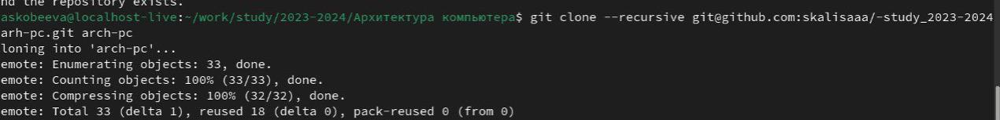

---
## Front matter
title: "Лабораторная работа № 2"
subtitle: "Отчет"
author: "Скобеева Алиса Алексеевна"

## Generic otions
lang: ru-RU
toc-title: "Содержание"

## Bibliography
bibliography: bib/cite.bib
csl: pandoc/csl/gost-r-7-0-5-2008-numeric.csl

## Pdf output format
toc: true # Table of contents
toc-depth: 2
lof: true # List of figures
lot: true # List of tables
fontsize: 12pt
linestretch: 1.5
papersize: a4
documentclass: scrreprt
## I18n polyglossia
polyglossia-lang:
  name: russian
  options:
	- spelling=modern
	- babelshorthands=true
polyglossia-otherlangs:
  name: english
## I18n babel
babel-lang: russian
babel-otherlangs: english
## Fonts
mainfont: IBM Plex Serif
romanfont: IBM Plex Serif
sansfont: IBM Plex Sans
monofont: IBM Plex Mono
mathfont: STIX Two Math
mainfontoptions: Ligatures=Common,Ligatures=TeX,Scale=0.94
romanfontoptions: Ligatures=Common,Ligatures=TeX,Scale=0.94
sansfontoptions: Ligatures=Common,Ligatures=TeX,Scale=MatchLowercase,Scale=0.94
monofontoptions: Scale=MatchLowercase,Scale=0.94,FakeStretch=0.9
mathfontoptions:
## Biblatex
biblatex: true
biblio-style: "gost-numeric"
biblatexoptions:
  - parentracker=true
  - backend=biber
  - hyperref=auto
  - language=auto
  - autolang=other*
  - citestyle=gost-numeric
## Pandoc-crossref LaTeX customization
figureTitle: "Рис."
tableTitle: "Таблица"
listingTitle: "Листинг"
lofTitle: "Список иллюстраций"
lotTitle: "Список таблиц"
lolTitle: "Листинги"
## Misc options
indent: true
header-includes:
  - \usepackage{indentfirst}
  - \usepackage{float} # keep figures where there are in the text
  - \floatplacement{figure}{H} # keep figures where there are in the text
---

# Цель работы

Ознакомиться с системой контроля версий Git, настроить его, завести репозиторий на сайте github и скинуть в него свои отчеты по лабораторным работам.

# Задание

Создать базовую конфигурацию для работы с git.
Создать ключ SSH.
Создать ключ PGP.
Настроить подписи git.
Зарегистрироваться на GitHub.
Создать локальный каталог для выполнения заданий по предмету.

# Выполнение лабораторной работы

*1. Базовая настройка git.*
Делаем предварительную конфигурацию git: 

{#fig:001 width=70%}

Настраиваем utf-8 в выводе сообщения git; задаем имя начальной ветки, как master; устанавливаем настройку autocrlf; устанавливаем параметр safecrlf:

{#fig:002 width=70%}

*2. Создание SSH ключа.*

{#fig:003 width=70%}

Генерируем пару ключей:

{#fig:004 width=70%}

Копируем ключ с помощью локальной консоли в буфер обмена; заходим в свой аккаунт на сайте github. Переходим в настройки. Добавляем скопированный ключ и указываем имя ключа(Title); проверяем добавление ключа:

{#fig:005 width=70%}

*3. Создание рабочего пространства и репозитория курса на основе шаблона.*

Открываем терминал и создаем каталог для предмета «Архитектура компьютера»:

{#fig:006 width=70%}

*4. Создание репозитория курса.*

Переходим на страницу репозитория с шаблоном; создаем репозиторий по шаблону и называем его «study_2023-2024_arh-pc»:

{#fig:007 width=70%}

Открываем терминал.

{#fig:008 width=70%}

*5. Настройка каталога курса.*

Переходим в каталог курса. Удаляем лишние файлы; создаем необходимые каталоги: 

{#fig:009 width=70%}

Отслеживаем файл и отправляем изменения в репозиторий; отправляем данные в репозиторий: 

{#fig:010 width=70%}

{#fig:011 width=70%}

# Вывод

Мы познакомились с системой контроля git, выучили команды для работы с ним, создали свой репозиторий на платформе github, где в последствии будут храниться все будущие отчеты по лабораторным работам.

