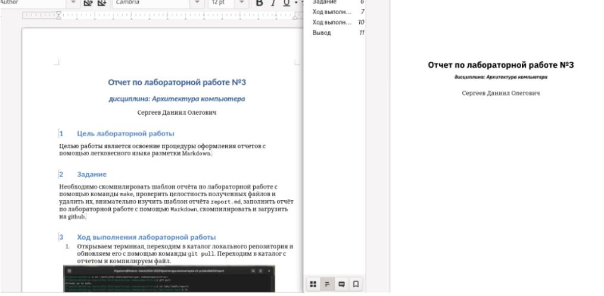

---
## Front matter
title: "Лабораторная работа № 3"
subtitle: "Отчет"
author: "Скобеева Алиса Алексеевна"

## Generic otions
lang: ru-RU
toc-title: "Содержание"

## Bibliography
bibliography: bib/cite.bib
csl: pandoc/csl/gost-r-7-0-5-2008-numeric.csl

## Pdf output format
toc: true # Table of contents
toc-depth: 2
lof: true # List of figures
lot: true # List of tables
fontsize: 12pt
linestretch: 1.5
papersize: a4
documentclass: scrreprt
## I18n polyglossia
polyglossia-lang:
  name: russian
  options:
	- spelling=modern
	- babelshorthands=true
polyglossia-otherlangs:
  name: english
## I18n babel
babel-lang: russian
babel-otherlangs: english
## Fonts
mainfont: IBM Plex Serif
romanfont: IBM Plex Serif
sansfont: IBM Plex Sans
monofont: IBM Plex Mono
mathfont: STIX Two Math
mainfontoptions: Ligatures=Common,Ligatures=TeX,Scale=0.94
romanfontoptions: Ligatures=Common,Ligatures=TeX,Scale=0.94
sansfontoptions: Ligatures=Common,Ligatures=TeX,Scale=MatchLowercase,Scale=0.94
monofontoptions: Scale=MatchLowercase,Scale=0.94,FakeStretch=0.9
mathfontoptions:
## Biblatex
biblatex: true
biblio-style: "gost-numeric"
biblatexoptions:
  - parentracker=true
  - backend=biber
  - hyperref=auto
  - language=auto
  - autolang=other*
  - citestyle=gost-numeric
## Pandoc-crossref LaTeX customization
figureTitle: "Рис."
tableTitle: "Таблица"
listingTitle: "Листинг"
lofTitle: "Список иллюстраций"
lotTitle: "Список таблиц"
lolTitle: "Листинги"
## Misc options
indent: true
header-includes:
  - \usepackage{indentfirst}
  - \usepackage{float} # keep figures where there are in the text
  - \floatplacement{figure}{H} # keep figures where there are in the text
---

# Цель работы

Освоение процедуры оформления отчетов лабораторных работ с помощью языка разметки Markdown.

# Задание

Необходимо скомпилировать шаблон отчета по лабораторной работе с помощью команды make, проверить целостность полученных данных и удалить их, внимательно изучить шаблон отчета report.md, заполнить отчет по лабораторной работе с помощью Markdown, скомпилировать и загрузить на Github.

# Выполнение лабораторной работы

Открываем терминал. Переходим в каталог курса, сформированный при выполнении работы № 2. Обновляем локальный репозиторий, скачав изменения из удаленного репозитория с помощью команды git pull.

{#fig:001 width=70%}

Проводим компиляцию шаблона с использованием Makelife. Для этого вводим команду make. Проверяем наличие файлов report.pdf и report.docx и удаляем их с помощью команды make clean. 

{#fig:002 width=70%}

Перед удалением файлов открываем и проверяем их.

{#fig:003 width=70%}

С помощью команды gedit report.md открываем файл report.

{#fig:004 width=70%}

# Выполнение самостоятельной работы

Создадим отчет лабораторной работы №2 и лабораторной работы №3 с помощью языка разметки Markdown и компилируем их с помощью Makefile.

Пишем отчеты в файлах report.md в соответствующих каталогах:

{#fig:005 width=70%}

{#fig:006 width=70%}

После написания отчета, сохраняем файлы и с помощью команды make компилируем их в pdf и docx. Отправляем в git.

{#fig:007 width=70%}

# Вывод

После выполнения заданий лабораторной работы мы научились оформлять отчеты с помощью языка разметки Markdown и компилировать их с помощью Makefile в pdf и doc.

