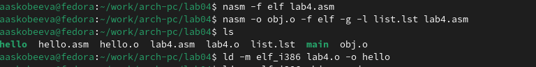

---
## Front matter
title: "Отчёт по лабораторной работе №4"
subtitle: "Создание и процесс обработки программ на языке ассемблера NASM"
author: "Скобеева Алиса Алексеевна"

## Generic otions
lang: ru-RU
toc-title: "Содержание"

## Bibliography
bibliography: bib/cite.bib
csl: pandoc/csl/gost-r-7-0-5-2008-numeric.csl

## Pdf output format
toc: true # Table of contents
toc-depth: 2
lof: true # List of figures
lot: true # List of tables
fontsize: 12pt
linestretch: 1.5
papersize: a4
documentclass: scrreprt
## I18n polyglossia
polyglossia-lang:
  name: russian
  options:
	- spelling=modern
	- babelshorthands=true
polyglossia-otherlangs:
  name: english
## I18n babel
babel-lang: russian
babel-otherlangs: english
## Fonts
mainfont: IBM Plex Serif
romanfont: IBM Plex Serif
sansfont: IBM Plex Sans
monofont: IBM Plex Mono
mathfont: STIX Two Math
mainfontoptions: Ligatures=Common,Ligatures=TeX,Scale=0.94
romanfontoptions: Ligatures=Common,Ligatures=TeX,Scale=0.94
sansfontoptions: Ligatures=Common,Ligatures=TeX,Scale=MatchLowercase,Scale=0.94
monofontoptions: Scale=MatchLowercase,Scale=0.94,FakeStretch=0.9
mathfontoptions:
## Biblatex
biblatex: true
biblio-style: "gost-numeric"
biblatexoptions:
  - parentracker=true
  - backend=biber
  - hyperref=auto
  - language=auto
  - autolang=other*
  - citestyle=gost-numeric
## Pandoc-crossref LaTeX customization
figureTitle: "Рис."
tableTitle: "Таблица"
listingTitle: "Листинг"
lofTitle: "Список иллюстраций"
lotTitle: "Список таблиц"
lolTitle: "Листинги"
## Misc options
indent: true
header-includes:
  - \usepackage{indentfirst}
  - \usepackage{float} # keep figures where there are in the text
  - \floatplacement{figure}{H} # keep figures where there are in the text
---

# Цель работы

Освоить процедуры компиляции и сборки программ, познакомиться с языком ассемблера NASM.

# Задание

Написать 2 программы: "Hello world"; "Имя Фамилия"

# Выполнение лабораторной работы

Создаем каталог для работы с программами на языке ассемблера NASM, переходим в него и создаем текстовый файл:

{#fig:fig1 width=70%}

После того, как открыли файл, вводим в него текст как в примере:

{#fig:fig2 width=70%}

Вводим команду для превращения текста в объектный код:

{#fig:fig3 width=70%}

Вводим команду, которая компилирует исходный файл hello.asm в obj.o:

{#fig:fig4 width=70%}

Передаем объектный файл на обработку компоновщику:

{#fig:fig5 width=70%}

Выполняем следующую команду:

{#fig:fig6 width=70%}

Запускаем на выполнение созданный исполняемый файл:

{#fig:fig7 width=70%}

# Выполнение самостоятельной работы

В нужном каталоге создаем копию файла hello.asm с именем lab4.asm:

{#fig:fig8 width=70%}

Открытый файл редактиурем в соответствии с заданием:

{#fig:fig9 width=70%}

Вводим необходимые команды для превращения текста в объектный код и превращения файла в объектный файл; выполняем компоновку объектного файла и запускаем получившийся исполняемый файл:

{#fig:fig10 width=70%}

{#fig:fig11 width=70%}

С помощью команды ./hello запускаем на выполнение исполняемый файл:

{#fig:fig12 width=70%}

Копируем файлы hello.asm и lab4.asm в необходимый каталог:

{#fig:fig13 width=70%}

Загружаем файлы на Github:

{#fig:fig14 width=70%}

# Выводы

После выполнения данной самостоятельной работы я познакомилась с языком ассемблера NASM и научилась создавать работающие программы.
