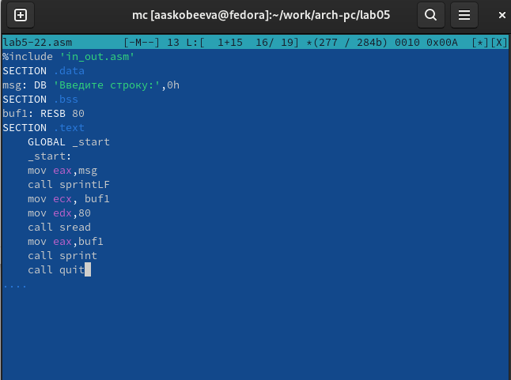

---
## Front matter
title: "Лабораторная работа №2"
subtitle: "Система контроля версий Git"
author: "Акунаева Антонина Эрдниевна"

## Generic otions
lang: ru-RU
toc-title: "Содержание"

## Bibliography
bibliography: bib/cite.bib
csl: pandoc/csl/gost-r-7-0-5-2008-numeric.csl

## Pdf output format
toc: true # Table of contents
toc-depth: 2
lof: true # List of figures
lot: true # List of tables
fontsize: 12pt
linestretch: 1.5
papersize: a4
documentclass: scrreprt
## I18n polyglossia
polyglossia-lang:
  name: russian
  options:
	- spelling=modern
	- babelshorthands=true
polyglossia-otherlangs:
  name: english
## I18n babel
babel-lang: russian
babel-otherlangs: english
## Fonts
mainfont: IBM Plex Serif
romanfont: IBM Plex Serif
sansfont: IBM Plex Sans
monofont: IBM Plex Mono
mathfont: STIX Two Math
mainfontoptions: Ligatures=Common,Ligatures=TeX,Scale=0.94
romanfontoptions: Ligatures=Common,Ligatures=TeX,Scale=0.94
sansfontoptions: Ligatures=Common,Ligatures=TeX,Scale=MatchLowercase,Scale=0.94
monofontoptions: Scale=MatchLowercase,Scale=0.94,FakeStretch=0.9
mathfontoptions:
## Biblatex
biblatex: true
biblio-style: "gost-numeric"
biblatexoptions:
  - parentracker=true
  - backend=biber
  - hyperref=auto
  - language=auto
  - autolang=other*
  - citestyle=gost-numeric
## Pandoc-crossref LaTeX customization
figureTitle: "Рис."
tableTitle: "Таблица"
listingTitle: "Листинг"
lofTitle: "Список иллюстраций"
lotTitle: "Список таблиц"
lolTitle: "Листинги"
## Misc options
indent: true
header-includes:
  - \usepackage{indentfirst}
  - \usepackage{float} # keep figures where there are in the text
  - \floatplacement{figure}{H} # keep figures where there are in the text
---

# 1 Цель работы

Изучить идеологию и применение средств контроля версий. Приобрести практические навыки по работе с системой git.

# 2 Задание

Базовая настройка github и git.  
Создание ключа SSH.  
Создание репозитория курса на основе шаблона.  
Настройка каталога курса.  

# 3 Выполнение лабораторной работы
1. Создайте учётную запись на сайте https://github.com/ и заполните основные данные.

{#fig:fig1 width=80%}

Аккаунт зарегистрирован на официальном сайте GitHub, почта подтверждена.

Основные данные для работы заполнены.

2. Откройте терминал и введите следующие команды, указав имя и email владельца репозитория:

git config --global user.name "<Name Surname>"

git config --global user.email "work@mail".

{#fig:fig2 width=80%}

{#fig:fig3 width=80%}

Прописываем указанные команды для настройки имени пользователя и почты аккаунта с помощью config от git с параметром --global для записи на глобальном уровне.

3. Настроим utf-8 в выводе сообщений git.

{#fig:fig4 width=80%}

Для корректного вывода информации (например, написанных на кириллице имён файлов) глобально переключим параметр quotepath секции core на false.

4. Зададим имя начальной ветки (будем называть её master).

{#fig:fig5 width=80%}

С помощью предписанной команды init.defaultBranch по её определению создаём основную ветку master.

5. Параметр autocrlf. Параметр safecrlf.

{#fig:fig6 width=80%}

{#fig:fig7 width=80%}

Значение заданного параметра autocrlf изменяем на input, что позволит заменять символы конца строки CRLF на LF при записи файла в репозиторий git и ничего не будет делать при чтении файла из репозитория.

Значение параметра safecrlf изменяем затем на warn, что позволит получить предупреждение о замене CRLF (с последующим переходом).

6. Для последующей идентификации пользователя на сервере репозиториев необходимо сгенерировать пару ключей (приватный и открытый).

{#fig:fig8 width=80%}

Сгенерируем SSH ключи при помощи утилиты shh-keygen, обозначив имя и почту пользователя, а также ключ -C для запроса на изменение комментария, что позволит получить более развёрнутую инструкцию по местонахождению ключей.

7. Скопируйте из локальной консоли ключ в буфер обмена.

{#fig:fig9 width=80%}

Скопируем в буфер обмена ключ, использовав команду для объединения данных файлов — cat с указанием пути до файла с ключом из комментария в предыдущем задании, также обозначив команду для копирования в буфер обмена xclip -sel clip.

8. Далее необходимо загрузить сгенерённый открытый ключ, скопировав из локальной консоли ключ в буфер обмена. Для этого зайти на сайт http://github.org/ под своей учётной записью и перейти в меню [Setting]. После этого выбрать в боковом меню [SSH and GPG keys] и нажать кнопку [New SSH key]. Вставляем ключ в появившееся на сайте поле и указываем для ключа имя (Title).

{#fig:fig10 width=80%}

{#fig:fig11 width=80%}

Следуя инструкции, переходим на страницу для создания нового SSH ключа на GitHub, задаём название key для удобства и вставим ключ из буфера обмена.

9. Откройте терминал и создайте каталог для предмета «Архитектура компьютера».

{#fig:fig12 width=80%}

Создадим каталог для хранения файлов лабораторных и других заданий по предмету, использовав команду mkdir в терминале с ключом -p, чтобы создать вложенные каталоги, и пропишем нужный путь.

10. Перейдите на страницу репозитория с шаблоном курса https://github.com/yamadharma/course-directory-student-template. Далее выберите [Use this template]. В открывшемся окне задайте имя репозитория (Repository name) study_2023–2024_arhpc и создайте репозиторий (кнопка Create repository from template).

{#fig:fig13 width=80%}

{#fig:fig14 width=80%}

Переходим по ссылке к открытому репозиторию другого пользователя и используем как шаблон для создания своей копии репозитория, прописав требуемое имя для него. Репозиторий создан.

11. Откройте терминал и перейдите в каталог курса.

{#fig:fig15 width=80%}

Перейдём в каталог курса, указав его путь, при помощи команды cd.

12. Клонируйте созданный репозиторий.

{#fig:fig16 width=80%}

Клонируем репозиторий при помощи команды clone и ключом –recursive для рекурсивного клонирования (с подмодулями), после указав адрес репозитория на аккаунте и место назначения.

13. Перейдите в каталог курса.

{#fig:fig17 width=80%}

Снова перейдём в каталог курса при помощи cd.

14. Удалите лишние файлы.

{#fig:fig18 width=80%}

Удалим лишний файл package.json при помощи команды rm, пока мы находимся в каталоге курса. Проверим при помощи ls.

15. Создайте необходимые каталоги.

{#fig:fig19 width=80%}
{#fig:fig20 width=80%}

Создаём файл COURSE с записанной строкой arch-pc при помощи команды echo, использовав одиночный >. Для обозначенной команды make требуется действие, что указывается в комментарии, однако файл итак был создан (что подтверждено командой ls).

16. Отправьте файлы на сервер.

{#fig:fig21 width=80%}

Добавим все созданные каталоги и файлы при помощи git add ., после  чего сохраним изменения следующей командой git commit -am с обозначением коммита в кавычках и отправим данные в центральный репозиторий из локального командой git push.

17. Проверьте правильность создания иерархии рабочего пространства в локальном репозитории и на странице github.

{#fig:fig22 width=80%}

{#fig:fig23 width=80%}

В локальном репозитории и на сайте GitHub пользователя присутствуют все указанные файлы в верно расставленной иерархии (папка labs из предыдущей лабораторной).

# 4 Описание результатов выполнения заданий для самостоятельной работы
1. Создайте отчет по выполнению лабораторной работы в соответствующем каталоге рабочего пространства (labs>lab02>report).

{#fig:fig24 width=80%}

{#fig:fig25 width=80%}

Создаём каталоги для хранения лабораторных через терминал, используя mkdir и ключ -p, также проверим успешность выполнения команды при помощи ls.

2. Скопируйте отчеты по выполнению предыдущих лабораторных работ в соответствующие каталоги созданного рабочего пространства.

{#fig:fig26 width=80%}

Перемещаем документ с отчётом в каталог labs/lab01/report.

3. Загрузите файлы на github.

{#fig:fig27 width=80%}

Переходим в каталог курса при помощи cd.

{#fig:fig28 width=80%}

Загружаем файлы на GitHub сначала при помощи команды git add, указав путь до каталога с отчётом к предыдущей лабораторной, затем сохраним при помощи commit -am, указав коммит. Отправляем данные в центральный репозиторий на сайт с git push.

{#fig:fig29 width=80%}

{#fig:fig30 width=80%}

Проверим наличие каталогов с отчётом на сайте GitHub в репозитории лабораторной. Файл отчёта действительно располагается в подкаталоге report.

# 5 Выводы

Я изучила идеологию и применение средств контроля версий и приобрела практические навыки по работе с системой git.
