---
## Front matter
title: "Отчёт по лабораторной работе №6"
subtitle: "Арифметические операции в NASM"
author: "Скобеева Алиса Алексеевна"

## Generic otions
lang: ru-RU
toc-title: "Содержание"

## Bibliography
bibliography: bib/cite.bib
csl: pandoc/csl/gost-r-7-0-5-2008-numeric.csl

## Pdf output format
toc: true # Table of contents
toc-depth: 2
lof: true # List of figures
lot: true # List of tables
fontsize: 12pt
linestretch: 1.5
papersize: a4
documentclass: scrreprt
## I18n polyglossia
polyglossia-lang:
  name: russian
  options:
	- spelling=modern
	- babelshorthands=true
polyglossia-otherlangs:
  name: english
## I18n babel
babel-lang: russian
babel-otherlangs: english
## Fonts
mainfont: IBM Plex Serif
romanfont: IBM Plex Serif
sansfont: IBM Plex Sans
monofont: IBM Plex Mono
mathfont: STIX Two Math
mainfontoptions: Ligatures=Common,Ligatures=TeX,Scale=0.94
romanfontoptions: Ligatures=Common,Ligatures=TeX,Scale=0.94
sansfontoptions: Ligatures=Common,Ligatures=TeX,Scale=MatchLowercase,Scale=0.94
monofontoptions: Scale=MatchLowercase,Scale=0.94,FakeStretch=0.9
mathfontoptions:
## Biblatex
biblatex: true
biblio-style: "gost-numeric"
biblatexoptions:
  - parentracker=true
  - backend=biber
  - hyperref=auto
  - language=auto
  - autolang=other*
  - citestyle=gost-numeric
## Pandoc-crossref LaTeX customization
figureTitle: "Рис."
tableTitle: "Таблица"
listingTitle: "Листинг"
lofTitle: "Список иллюстраций"
lotTitle: "Список таблиц"
lolTitle: "Листинги"
## Misc options
indent: true
header-includes:
  - \usepackage{indentfirst}
  - \usepackage{float} # keep figures where there are in the text
  - \floatplacement{figure}{H} # keep figures where there are in the text
---

# Цель работы

Освоить арифметические инструкции языка ассемблера NASM и написать программы для вычисления арифметических выражений с неизвестной. 

# Выполнение лабораторной работы
## Символьные и численные данные в NASM
Создаем каталог для программ лабораторной работы №6, переходим в него и создаем файл lab6-1.asm:

{#fig:fig1 width=70%}

Вводим в файл текст программы из листинга 6.1:

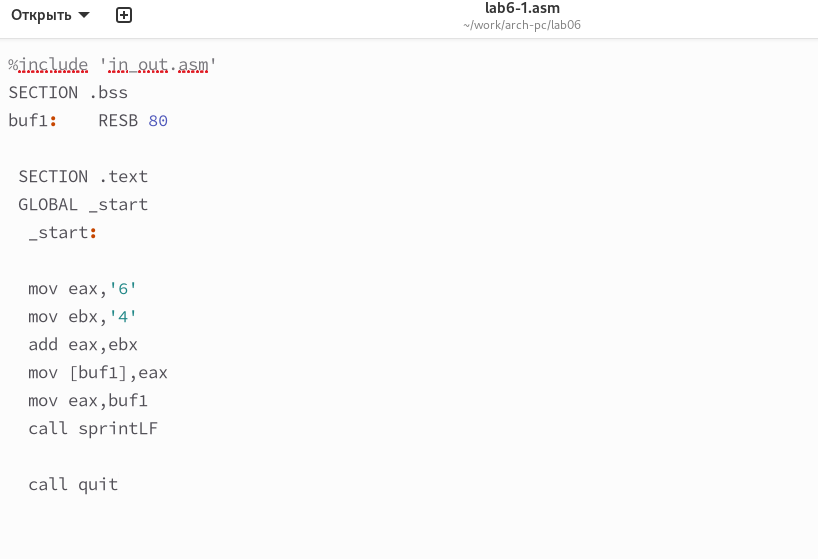{#fig:fig2 width=70%}

Создаем исполняемый файл и запускаем его:

{#fig:fig3 width=70%}

Открываем файл для редактирования и убираем кавычки с числовых значений:

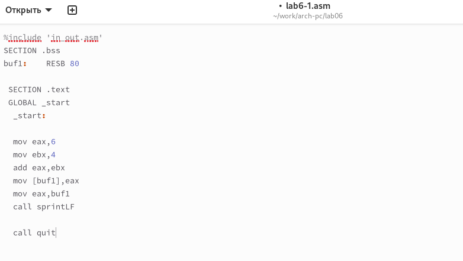{#fig:fig4 width=70%}

Создаем исполняемый файл и запускаем его:

{#fig:fig5 width=70%}

Создаем новый файл в каталоге:

{#fig:fig6 width=70%}

Заполняем файл в соответствии с листингом 6.2:

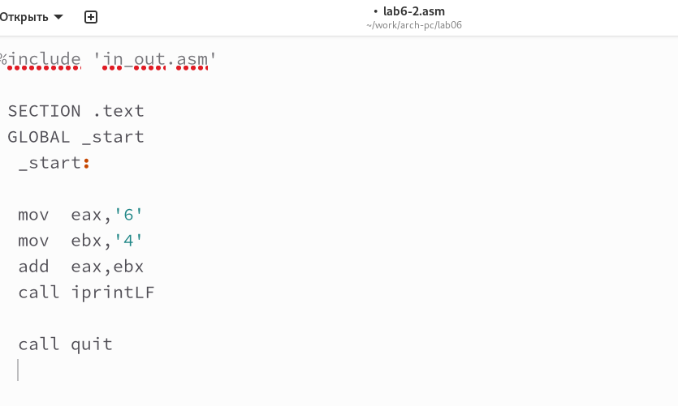{#fig:fig7 width=70%}

Создаем исполняемый файл и запускаем его:

{#fig:fig8 width=70%}

Снова открываем файл для редактирования и убираем кавычки с числовых значений:

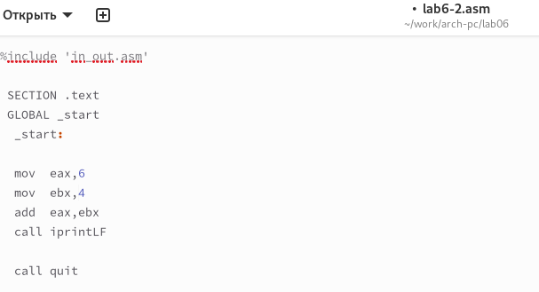{#fig:fig9 width=70%}

Создаем исполняемый файл и запускаем его:

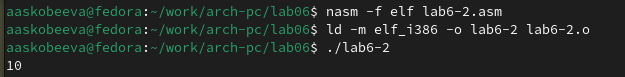{#fig:fig10 width=70%}

Снова открываем файл для редактирования и меняем iprintLF на iprint: 

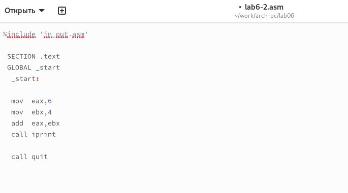{#fig:fig11 width=70%}

Создаем исполняемый файл и запускаем его:

{#fig:fig12 width=70%}

Таким образом, можем сделать вывод, что вывод функций iprintLF и iprint отличаются только тем, что LF переносит на новую строку.

## Выполнение арифметических операций в NASM

Создаем новый файл в каталоге:

{#fig:fig13 width=70%}

Открываем файл и редактируем его в соответствии с листингом 6.3:

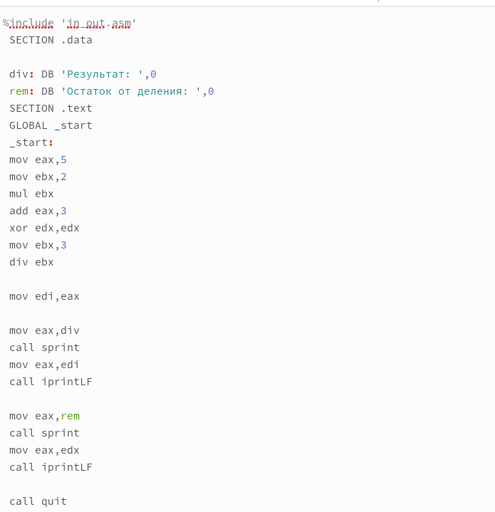{#fig:fig14 width=70%}

Создаем исполняемый файл и запускаем его

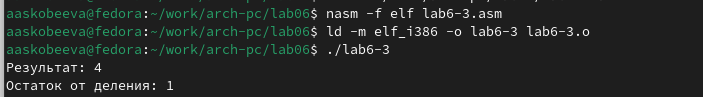{#fig:fig15 width=70%}

Открываем файл и редактируем его для вычисления выражения f(x) = (4*6 2)/5:

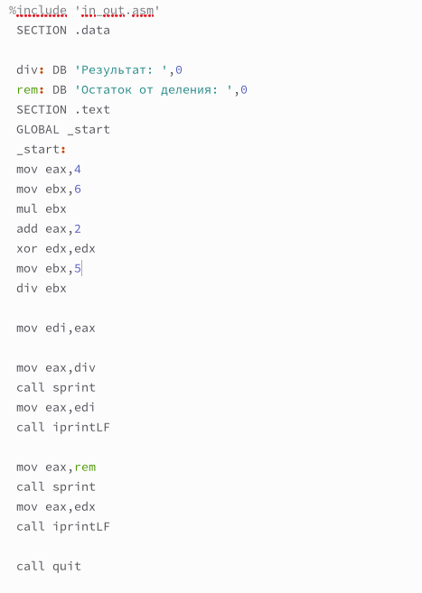{#fig:fig16 width=70%}

Компилируем файл и запускаем программу:

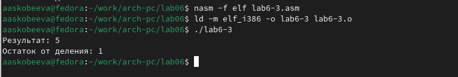{#fig:fig17 width=70%}

Создаем новый файл в каталоге, открываем его и редактируем его в соответствии с листингом 6.4:

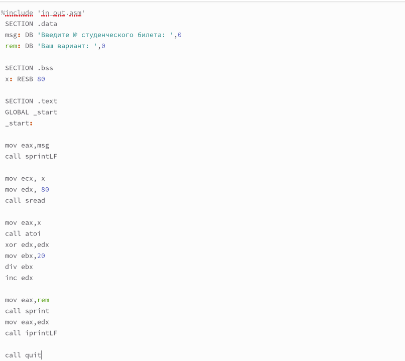{#fig:fig18 width=70%}

Компилируем файл и запускаем его:

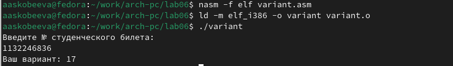{#fig:fig19 width=70%}

## Ответы на вопросы по программе

1. Строка "mov eax,rem" и строка "call sprint" отвечают за вывод на экран сообщения 'Ваш вариант: '.
2. Данные инструкции используются для чтения строки с вводом данных от пользователя. Начальный адрес строки сохраняется в регистре ecx, а количество символов в строке (макс. кол-во символов, которое может быть считано) сохраняется в регистре edx. Затем вызывается процедура sread, которая выполняет чтение строки.
3. Инструкция "call atoi" используется для преобразования строки в целое число. Она принимает адрес строки в регистре eax и возвращает полученное число в регистре eax. 
4. Строка "xor edx,edx" обнуляет регистр edx перед выполнением деления. Строка "mov ebx,20" загружает значение 20 в регистр ebx. Строка "div ebx" выполняет деление регистра eax на значение регистра ebx с сохранением частного в регистре и остатка в регистре edx. 
5. Остаток от деления записывается в регистр edx.
6. Инструкция "inc edx" используется для увеличения значения в регистре edx на 1. В данном случае, она увеличивает остаток от деления на 1.
7. Строка "mov eax,edx" передает значение остатка от деления в регистр eax. Строка "call iprintLF" вызывает процедуру iprintLF для вывода значения на экран вместе с переводом строки.

## Задание для самостоятельной работы

Создаем новый файл в каталоге, открываем его и заполняем, чтобы решалось выражение f(x) = x^3*1/3+21:

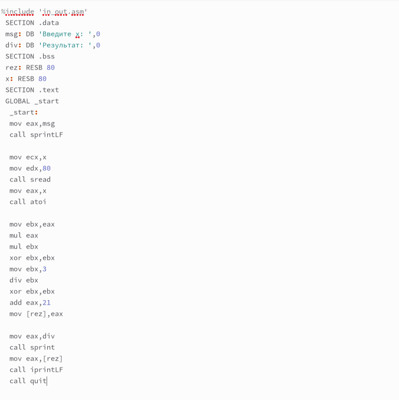{#fig:fig20 width=70%}

Компилируем программу и проверяем для х=1:

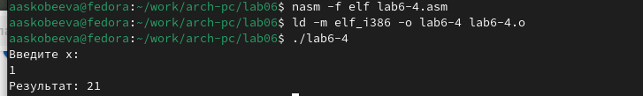{#fig:fig21 width=70%}

Компилируем программу и проверяем для х=3:

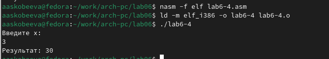{#fig:fig22 width=70%}

# Выводы

Я приобрела навыки создания исполняемых файлов для решения выражений и освоила арифметические инструкции в NASM.
