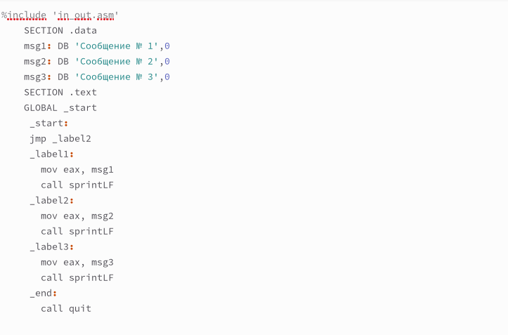
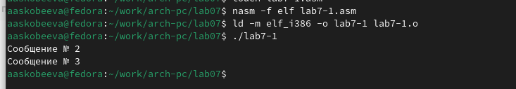

---
## Front matter
title: "Отчёт по лабораторной работе №7"
subtitle: "Команды безусловного и условного перехода в NASM. Программирование ветвлений."
author: "Скобеева Алиса Алексеевна"

## Generic otions
lang: ru-RU
toc-title: "Содержание"

## Bibliography
bibliography: bib/cite.bib
csl: pandoc/csl/gost-r-7-0-5-2008-numeric.csl

## Pdf output format
toc: true # Table of contents
toc-depth: 2
lof: true # List of figures
lot: true # List of tables
fontsize: 12pt
linestretch: 1.5
papersize: a4
documentclass: scrreprt
## I18n polyglossia
polyglossia-lang:
  name: russian
  options:
	- spelling=modern
	- babelshorthands=true
polyglossia-otherlangs:
  name: english
## I18n babel
babel-lang: russian
babel-otherlangs: english
## Fonts
mainfont: IBM Plex Serif
romanfont: IBM Plex Serif
sansfont: IBM Plex Sans
monofont: IBM Plex Mono
mathfont: STIX Two Math
mainfontoptions: Ligatures=Common,Ligatures=TeX,Scale=0.94
romanfontoptions: Ligatures=Common,Ligatures=TeX,Scale=0.94
sansfontoptions: Ligatures=Common,Ligatures=TeX,Scale=MatchLowercase,Scale=0.94
monofontoptions: Scale=MatchLowercase,Scale=0.94,FakeStretch=0.9
mathfontoptions:
## Biblatex
biblatex: true
biblio-style: "gost-numeric"
biblatexoptions:
  - parentracker=true
  - backend=biber
  - hyperref=auto
  - language=auto
  - autolang=other*
  - citestyle=gost-numeric
## Pandoc-crossref LaTeX customization
figureTitle: "Рис."
tableTitle: "Таблица"
listingTitle: "Листинг"
lofTitle: "Список иллюстраций"
lotTitle: "Список таблиц"
lolTitle: "Листинги"
## Misc options
indent: true
header-includes:
  - \usepackage{indentfirst}
  - \usepackage{float} # keep figures where there are in the text
  - \floatplacement{figure}{H} # keep figures where there are in the text
---

# Цель работы

Освоить условный и безусловный переход. Ознакомиться с назначением и структурой файла листинга.

# Выполнение лабораторной работы
## Реализация переходов в NASM
Создаем каталог для программ лабораторной работы №7, переходим в него и создаем файл lab7-1.asm:

{#fig:fig1 width=70%}

Вводим в файл текст программы из листинга 7.1:

{#fig:fig2 width=70%}

Создаем исполняемый файл и запускаем его:

{#fig:fig3 width=70%}

Открываем файл для редактирования и изменяем его в соответствии с листингом 7.2:

{#fig:fig4 width=70%}

Создаем исполняемый файл и запускаем его:

{#fig:fig5 width=70%}

Снова открываем файл для редактирования и изменяем его, чтобы произошел данный вывод:

{#fig:fig6 width=70%}

Создаем исполняемый файл и запускаем его:

{#fig:fig7 width=70%}

Создаем новый файл, открываем файл в Midnight Commander и заполняем его в соответствии с листингом 7.3:

{#fig:fig8 width=70%}

Создаем исполняемый файл и проверяем его работу, вводя разные значения В:

{#fig:fig9 width=70%}

## Изучение структуры файла листинга

Создаем файл листинга для программы lab7-2.asm: 

{#fig:fig10 width=70%}

Открываем файл листинга и изучаем его:

{#fig:fig11 width=70%}

Строка 33: 0000001D-адрес в сегменте кода, BB01000000-машинный код, mov ebx,1-присвоение переменной ecx значения 1.
Строка 34: 00000022-адрес в сегменте кода, В804000000-машинный код, mov eax,4-присвоение еах значения 4.
Строка 35: 00000027-адрес в сегменте кода, СD-машинный код, int 80h-вызов ядра.

Открываем файл и удаляем один операндум:

{#fig:fig12 width=70%}

Транслируем с получением файла листинга:

{#fig:fig13 width=70%}

При трансляции файла, выдается ошибка, но создаются исполнительные файлы lab7-2 и lab7-2.lst

Снова открываем файл листинга и изучаем его:

{#fig:fig14 width=70%}

## Задание для самостоятельной работы
ВАРИАНТ-17

Задание 1.

Создаем новый файл и открываем его и пишем программу, которая выберет наименьшее число из трех(2 числа уже в программе,3е выводится из консоли):

{#fig:fig15 width=70%}

Транслируем файл и смотрим на работу программы:

{#fig:fig16 width=70%}

Задание 2.

Создаем новый файл, открываем его и пишем программу, которая решит систему уравнений при данных, введенных в консоль:

{#fig:fig20 width=70%}

Транслируем файл и проверяем его работу при х=3, а=4:

{#fig:fig21 width=70%}

Компилируем программу и проверяем для х=2, а=9:

{#fig:fig22 width=70%}

# Выводы

Мы познакомились со структурой файла листинга, изучили команды условного и безусловного перехода.
