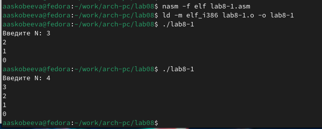
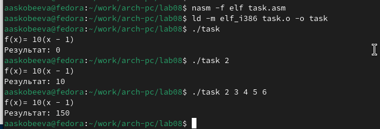

---
## Front matter
title: "Отчёт по лабораторной работе 8"
subtitle: "Программирование цикла. Обработка аргументов командной строки."
author: "Скобеева Алиса Алексеевна"

## Generic otions
lang: ru-RU
toc-title: "Содержание"

## Bibliography
bibliography: bib/cite.bib
csl: pandoc/csl/gost-r-7-0-5-2008-numeric.csl

## Pdf output format
toc: true # Table of contents
toc-depth: 2
lof: true # List of figures
lot: true # List of tables
fontsize: 12pt
linestretch: 1.5
papersize: a4
documentclass: scrreprt
## I18n polyglossia
polyglossia-lang:
  name: russian
  options:
	- spelling=modern
	- babelshorthands=true
polyglossia-otherlangs:
  name: english
## I18n babel
babel-lang: russian
babel-otherlangs: english
## Fonts
mainfont: PT Serif
romanfont: PT Serif
sansfont: PT Sans
monofont: PT Mono
mainfontoptions: Ligatures=TeX
romanfontoptions: Ligatures=TeX
sansfontoptions: Ligatures=TeX,Scale=MatchLowercase
monofontoptions: Scale=MatchLowercase,Scale=0.9
## Biblatex
biblatex: true
biblio-style: "gost-numeric"
biblatexoptions:
  - parentracker=trueЗырянов Артём Алексеевич	НБИбд-01-22

  - backend=biber
  - hyperref=auto
  - language=auto
  - autolang=other*
  - citestyle=gost-numeric
## Pandoc-crossref LaTeX customization
figureTitle: "Рис."
tableTitle: "Таблица"
listingTitle: "Листинг"
lofTitle: "Список иллюстраций"
lotTitle: "Список таблиц"
lolTitle: "Листинги"
## Misc options
indent: true
header-includes:
  - \usepackage{indentfirst}
  - \usepackage{float} # keep figures where there are in the text
  - \floatplacement{figure}{H} # keep figures where there are in the text
---

# Цель работы

Целью работы является приобретение навыков написания программ с использованием циклов и обработкой аргументов командной строки..

# Выполнение лабораторной работы

## Реализация циклов в NASM

Мы создали каталог для программ лабораторной работы №8, перешли в него и добавили файл lab8-1.asm.

В файл lab8-1.asm был внесен текст программы из листинга 8.1. Затем мы скомпилировали и протестировали её выполнение.

{ #fig:001 width=70%, height=70% }

{ #fig:002 width=70%, height=70% }

На примере выяснили, что использование регистра ecx в теле цикла loop может привести к некорректной работе программы. Мы изменили текст программы, добавив изменение значения регистра ecx в цикле, создали исполняемый файл и проверили его. При этом регистр ecx принимает значения, зависящие от начального N. 

- Программа запускает бесконечный цикл при нечетном N и выводит только нечетные числа при четном N.

{ #fig:003 width=70%, height=70% }

{ #fig:004 width=70%, height=70% }

Чтобы сохранить корректность работы программы при использовании регистра ecx, был применён стек. Мы добавили команды push и pop для сохранения значения счетчика цикла loop. Исполняемый файл был создан и протестирован. В этом случае число проходов цикла соответствует значению N, введенному с клавиатуры.

- Программа выводит числа от N-1 до 0, и цикл выполняется корректное количество раз.

{ #fig:005 width=70%, height=70% }

{ #fig:006 width=70%, height=70% }

## Обработка аргументов командной строки

В каталоге ~/work/arch-pc/lab08 мы создали файл lab8-2.asm и добавили в него текст программы из листинга 8.2. Программа была скомпилирована и запущена с аргументами. 

- Программа обработала 4 аргумента.

{ #fig:007 width=70%, height=70% }

{ #fig:008 width=70%, height=70% }

Мы изучили пример программы, которая вычисляет сумму чисел, переданных в качестве аргументов.

{ #fig:009 width=70%, height=70% }

{ #fig:010 width=70%, height=70% }

Изменили текст программы из листинга 8.3 для вычисления произведения аргументов командной строки.

{ #fig:011 width=70%, height=70% }

{ #fig:012 width=70%, height=70% }

## Задание для самостоятельной работы

Мы разработали программу для вычисления суммы значений функции f(x) для набора x = x1, x2, ..., xn. Вид функции f(x) был выбран в соответствии с вариантом задания №12 из таблицы 8.1: 

- Для варианта 17: f(x) = 10(x - 1).

Программа была протестирована на нескольких наборах x.

{ #fig:013 width=70%, height=70% }

{ #fig:014 width=70%, height=70% }

# Выводы

Мы освоили работу со стеком, циклами и аргументами на ассемблере NASM.
