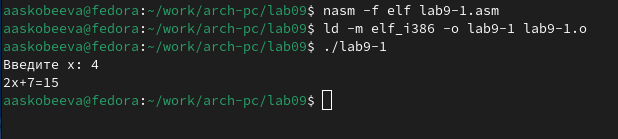

---
## Front matter
title: "Отчёт по лабораторной работе 9"
subtitle: "Понятие подпрограммы. Отладчик GDB."
author: "Скобеева Алиса Алексеевна"

## Generic otions
lang: ru-RU
toc-title: "Содержание"

## Bibliography
bibliography: bib/cite.bib
csl: pandoc/csl/gost-r-7-0-5-2008-numeric.csl

## Pdf output format
toc: true # Table of contents
toc-depth: 2
lof: true # List of figures
lot: true # List of tables
fontsize: 12pt
linestretch: 1.5
papersize: a4
documentclass: scrreprt
## I18n polyglossia
polyglossia-lang:
  name: russian
  options:
	- spelling=modern
	- babelshorthands=true
polyglossia-otherlangs:
  name: english
## I18n babel
babel-lang: russian
babel-otherlangs: english
## Fonts
mainfont: PT Serif
romanfont: PT Serif
sansfont: PT Sans
monofont: PT Mono
mainfontoptions: Ligatures=TeX
romanfontoptions: Ligatures=TeX
sansfontoptions: Ligatures=TeX,Scale=MatchLowercase
monofontoptions: Scale=MatchLowercase,Scale=0.9
## Biblatex
biblatex: true
biblio-style: "gost-numeric"
biblatexoptions:
  - parentracker=true
  - backend=biber
  - hyperref=auto
  - language=auto
  - autolang=other*
  - citestyle=gost-numeric
## Pandoc-crossref LaTeX customization
figureTitle: "Рис."
tableTitle: "Таблица"
listingTitle: "Листинг"
lofTitle: "Список иллюстраций"
lotTitle: "Список таблиц"
lolTitle: "Листинги"
## Misc options
indent: true
header-includes:
  - \usepackage{indentfirst}
  - \usepackage{float} # keep figures where there are in the text
  - \floatplacement{figure}{H} # keep figures where there are in the text
---

# Цель работы

Целью работы является приобретение навыков написания программ с использованием подпрограмм.
Знакомство с методами отладки при помощи GDB и его основными возможностями.

# Выполнение лабораторной работы

## Реализация подпрограмм в NASM

Мы создали каталог для выполнения лабораторной работы №9, перешли в него и добавили файл lab9-1.asm.

В качестве примера рассмотрена программа для вычисления арифметического выражения $f(x) = 2x + 7$ с использованием подпрограммы calcul. Ввод значения $x$ осуществляется с клавиатуры, а вычисление производится в подпрограмме.

{ #fig:001 width=70%, height=70% }

{ #fig:002 width=70%, height=70% }

Изменили текст программы, добавив подпрограмму subcalcul в calcul для вычисления выражения $f(g(x))$, где $f(x) = 2x + 7$, $g(x) = 3x - 1$, и $x$ вводится с клавиатуры.

{ #fig:003 width=70%, height=70% }

{ #fig:004 width=70%, height=70% }

## Отладка программам с помощью GDB

Мы создали файл lab9-2.asm, содержащий текст программы из листинга 9.2 (программа для вывода сообщения "Hello, world!"). Добавили отладочную информацию для работы с GDB, указав флаг -g при трансляции. Программа была протестирована в GDB.

{ #fig:005 width=70%, height=70% }

{ #fig:006 width=70%, height=70% }

Установили брейкпоинт на метке _start, запустили программу и просмотрели дизассемблированный код в различных режимах.

{ #fig:007 width=70%, height=70% }

{ #fig:008 width=70%, height=70% }

Определили адрес предпоследней инструкции и установили точку останова. Проверили изменения значений регистров с помощью команды stepi.

{ #fig:009 width=70%, height=70% }

{ #fig:010 width=70%, height=70% }

{ #fig:011 width=70%, height=70% }

Посмотрели значения переменных msg1 и msg2 по имени и адресу соответственно. Изменили значение первого символа переменной msg1.

{ #fig:012 width=70%, height=70% }

Вывели значение регистра edx в различных форматах (шестнадцатеричном, двоичном, символьном) и изменили его значение.

{ #fig:013 width=70%, height=70% }

{ #fig:014 width=70%, height=70% }

Скопировали файл lab8-2.asm из предыдущей работы, создали исполняемый файл и запустили его с аргументами в GDB, установив точку останова перед началом программы. Исследовали адреса, связанные с аргументами командной строки.

{ #fig:015 width=70%, height=70% }

## Задание для самостоятельной работы

Преобразовали программу из лабораторной работы №8 (задание №1) для вычисления значения функции $f(x)$ как подпрограмму.

{ #fig:016 width=70%, height=70% }

{ #fig:017 width=70%, height=70% }

Проанализировали и исправили ошибку в программе для вычисления $(3+2)*4+5$ с помощью отладчика GDB. Ошибка заключалась в неправильном порядке аргументов инструкции add и некорректном завершении программы (использование ebx вместо eax).

{ #fig:018 width=70%, height=70% }

{ #fig:019 width=70%, height=70% }

{ #fig:020 width=70%, height=70% }

{ #fig:021 width=70%, height=70% }

# Выводы

Мы освоили работу с подпрограммами и отладчиком GDB, а также изучили методы анализа и исправления ошибок в ассемблерных программах.
