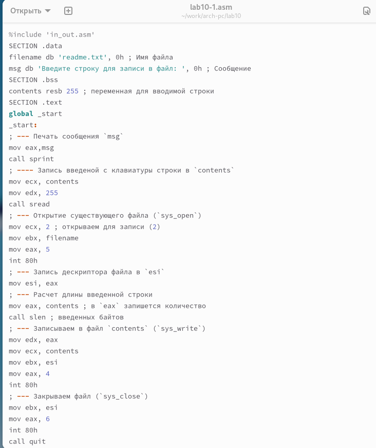
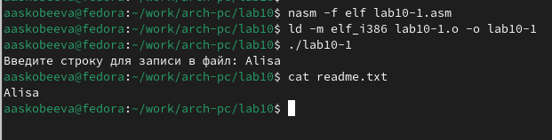
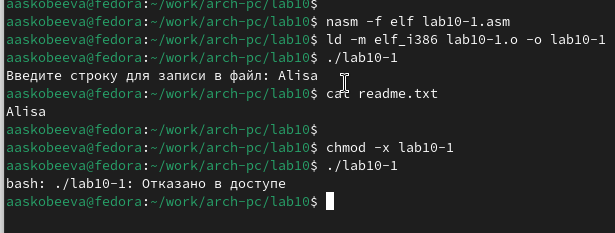
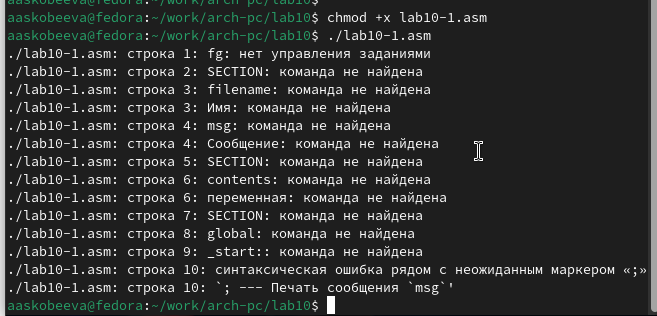
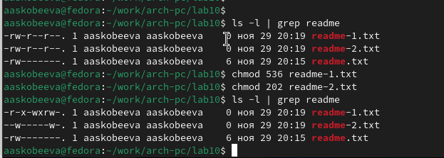
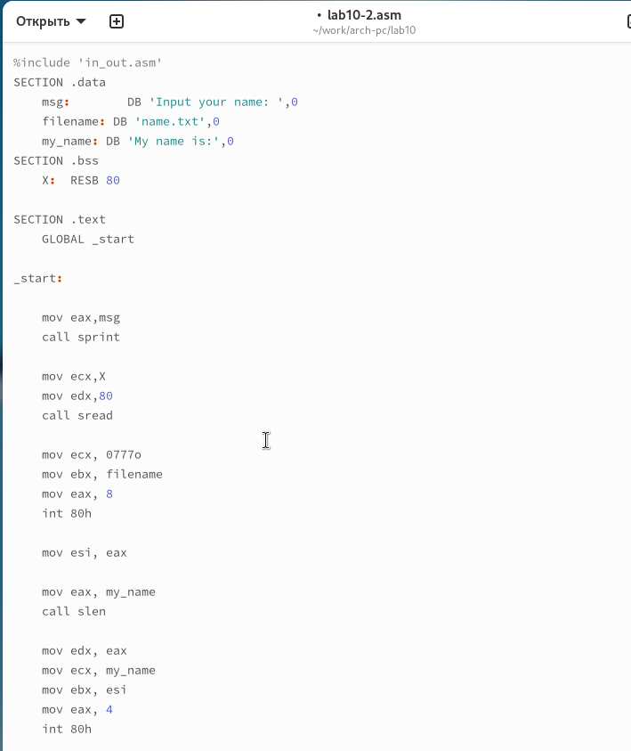
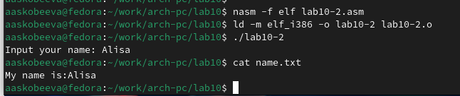

---
## Front matter
title: "Отчёт по лабораторной работе 10"
subtitle: "Работа с файлами средствами Nasm"
author: "Скобеева Алиса Алексеевна"

## Generic otions
lang: ru-RU
toc-title: "Содержание"

## Bibliography
bibliography: bib/cite.bib
csl: pandoc/csl/gost-r-7-0-5-2008-numeric.csl

## Pdf output format
toc: true # Table of contents
toc-depth: 2
lof: true # List of figures
lot: true # List of tables
fontsize: 12pt
linestretch: 1.5
papersize: a4
documentclass: scrreprt
## I18n polyglossia
polyglossia-lang:
  name: russian
  options:
	- spelling=modern
	- babelshorthands=true
polyglossia-otherlangs:
  name: english
## I18n babel
babel-lang: russian
babel-otherlangs: english
## Fonts
mainfont: PT Serif
romanfont: PT Serif
sansfont: PT Sans
monofont: PT Mono
mainfontoptions: Ligatures=TeX
romanfontoptions: Ligatures=TeX
sansfontoptions: Ligatures=TeX,Scale=MatchLowercase
monofontoptions: Scale=MatchLowercase,Scale=0.9
## Biblatex
biblatex: true
biblio-style: "gost-numeric"
biblatexoptions:
  - parentracker=true
  - backend=biber
  - hyperref=auto
  - language=auto
  - autolang=other*
  - citestyle=gost-numeric
## Pandoc-crossref LaTeX customization
figureTitle: "Рис."
tableTitle: "Таблица"
listingTitle: "Листинг"
lofTitle: "Список иллюстраций"
lotTitle: "Список таблиц"
lolTitle: "Листинги"
## Misc options
indent: true
header-includes:
  - \usepackage{indentfirst}
  - \usepackage{float} # keep figures where there are in the text
  - \floatplacement{figure}{H} # keep figures where there are in the text
---

# Цель работы

Целью работы является приобретение навыков написания программ для работы с файлами.

# Выполнение лабораторной работы

Мы создали каталог для выполнения лабораторной работы №10, перешли в него и добавили файлы lab10-1.asm, readme-1.txt и readme-2.txt.

В файл lab10-1.asm был добавлен текст программы из листинга 10.1 (программа записи сообщения в файл). После трансляции создали исполняемый файл и протестировали его.

{ #fig:001 width=70%, height=70% }

{ #fig:002 width=70%, height=70% }

С помощью команды chmod изменили права доступа к исполняемому файлу lab10-1, запретив выполнение (сняли атрибут x). Попытка выполнить файл завершилась неудачей, так как запуск запрещен.

{ #fig:003 width=70%, height=70% }

Изменили права доступа к файлу lab10-1.asm, добавив разрешение на выполнение. При попытке выполнить файл терминал трактовал его содержимое как команды оболочки, что привело к ошибкам, поскольку инструкции ассемблера не являются командами терминала. Тем не менее, если бы в файле находились команды терминала, их можно было бы выполнить.

{ #fig:004 width=70%, height=70% }

Предоставили права доступа к файлам readme-1.txt и readme-2.txt в соответствии с вариантом 17 из таблицы 10.4: r-x -wx rw- и 010 000 010. Проверили результат с помощью команды ls -l.

{ #fig:005 width=70%, height=70% }

## Задание для самостоятельной работы

Написали программу, работающую по следующему алгоритму:
* Вывод приглашения: “Как Вас зовут?”
* Ввод фамилии и имени с клавиатуры.
* Создание файла name.txt.
* Запись в файл строки: “Меня зовут”.
* Добавление в файл введенной строки.
* Закрытие файла.

{ #fig:006 width=70%, height=70% }

{ #fig:007 width=70%, height=70% }

# Выводы

Мы освоили работу с файлами и их правами доступа, а также научились управлять разрешениями для файлов и обрабатывать ввод-вывод в ассемблерных программах.
